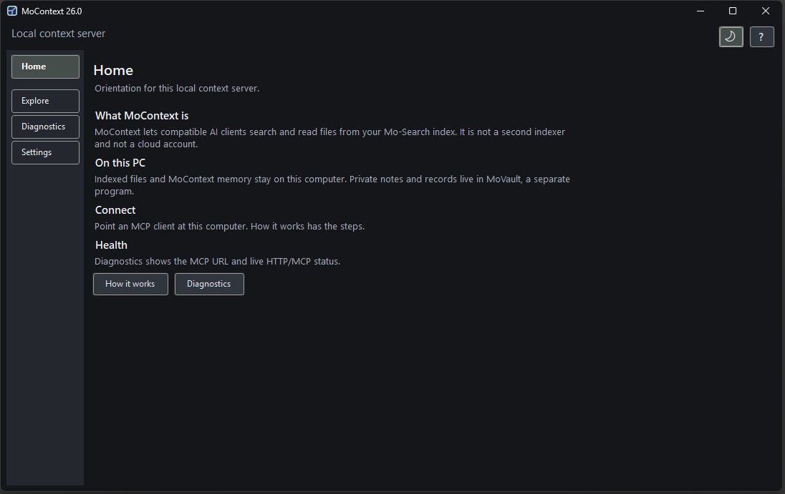

# MoContext

> Documentation baseline: Mo-Search/MoContext 26.0, the current public
> release.

**Give your AI agent full-text search over the files you index on your Windows
computer.**

MoContext is a local [MCP](https://modelcontextprotocol.io) server that exposes
the [Mo-Search](https://www.meauxsoft.com) desktop search index to AI agents.
Mo-Search has been indexing Windows machines since 2005 — millions of files,
full text, ranked results in milliseconds. MoContext puts that index behind 15
MCP tools so Codex, Claude Code, Cursor, Windsurf, VS Code, or another
compatible MCP client can find and read indexed files — plus keep durable,
human-editable session memory.



The screenshot above is the MoContext 26.0 local context server. A workflow GIF
is planned for a later release.

## Why

- **The index already exists.** Mo-Search users have a continuously updated
  full-text index of their entire machine. MoContext is a read-mostly MCP layer
  over it — no separate crawler, no re-indexing, no embedding pipeline.
- **Beyond one repo.** Your agent can answer "where did I handle this before?"
  across the projects, documents, and notes included in your Mo-Search index —
  including files you last touched years ago.
- **Local service and index.** MoContext listens on `127.0.0.1` by default,
  reads the local Mo-Search index, and does not require a MoContext cloud
  account. See [Privacy](#privacy) for the important AI-client boundary.
- **Schema beats prompts.** Session memory (`SaveContext`) uses a structured
  digest schema with a server-side quality gate, plus an auto-generated weekly
  rollup — so "what did we do last week?" has a real answer.

## Quick start

1. **Install [Mo-Search](https://www.meauxsoft.com)** (Windows 10/11).
   MoContext is currently included in the same installer and starts
   automatically.
2. **Connect your client** to `http://127.0.0.1:43210/mcp`:

**Codex**

```
codex mcp add mocontext --url http://127.0.0.1:43210/mcp
```

[Official Codex MCP documentation](https://developers.openai.com/codex/concepts/customization#mcp)

**Claude Code**

```
claude mcp add --transport http mocontext http://127.0.0.1:43210/mcp
```

[Official Claude Code MCP documentation](https://docs.anthropic.com/en/docs/claude-code/mcp)

**Cursor** (`~/.cursor/mcp.json` or `.cursor/mcp.json` in a project)

```json
{ "mcpServers": { "mocontext": { "url": "http://127.0.0.1:43210/mcp" } } }
```

[Official Cursor MCP documentation](https://docs.cursor.com/context/model-context-protocol)

**VS Code** (`.vscode/mcp.json`)

```json
{ "servers": { "mocontext": { "type": "http", "url": "http://127.0.0.1:43210/mcp" } } }
```

[Official VS Code MCP configuration reference](https://code.visualstudio.com/docs/agents/reference/mcp-configuration)

**Windsurf** (`~/.codeium/windsurf/mcp_config.json`)

```json
{ "mcpServers": { "mocontext": { "serverUrl": "http://127.0.0.1:43210/mcp" } } }
```

[Official Windsurf MCP documentation](https://docs.windsurf.com/windsurf/cascade/mcp)

These examples follow the current client configuration formats. Client
features and configuration locations can change, so also consult the client's
official MCP documentation. Claude Desktop is not listed here because its
custom connector flow expects a remotely reachable server; packaging a
supported local Desktop extension is a separate future task.

3. **Try it** — ask your agent:

> Use MoContext to find where I configured SMTP settings, anywhere on this machine.

## The tools

| Tool | What it does |
|------|-------------|
| `get_server_summary` | One-call orientation: status, budgets, capabilities, doc/memory paths |
| `get_usage_guide` | Compact guidance for choosing tools |
| `get_health` | Liveness check; `index.newest_indexed_at` shows index recency |
| `get_diagnostics` | Verbose runtime and index details |
| `find_files` | File discovery: ranked search, recent-index browse, or hot/warm working set |
| `get_evidence_pack` | The primary retrieval tool: ranked files + bounded source windows with line numbers |
| `read_file` | Read any file: whole, range, or window around a line |
| `record_activity` | Save a lightweight work-checkpoint note |
| `get_recent_activity` | List recent notes; `group_by: "topic"` for the topic overview |
| `get_activity_briefing` | Compact recap of recent work for context injection |
| `list_context_files` | Inventory docs and memory files |
| `read_context_file` | Read one of them by scope + relative path |
| `write_memory_file` | Create/update durable Markdown memory notes |
| `save_context_digest` | `SaveContext`: structured long-term memory digest (quality-gated) |
| `load_context_digest` | `LoadContext`: recall saved digests + recent working set |

Every search result carries `last_indexed` and `mtime_newer_than_index` so the
agent knows when to re-read a file from disk instead of trusting the index.

### Bonus: checkpoints that survive context compaction

When a long agent session compacts its context window, detail is lost.
MoContext's activity journal is the antidote — and in Claude Code you can make
the checkpoint automatic with a `SessionStart` hook (its stdout is injected
into the agent's context right after every compaction). Add to
`.claude/settings.json`:

```json
{
  "hooks": {
    "SessionStart": [
      {
        "matcher": "compact",
        "hooks": [
          {
            "type": "command",
            "command": "echo Context was just compacted. Before resuming, call the MoContext record_activity tool: summary_text = concrete work completed so far (files, commits, decisions), next_step_text = the exact next action, topic_key = the ongoing thread. Then continue the task."
          }
        ]
      }
    ]
  }
}
```

The next session (or the same one, post-compaction) picks the thread back up
via `get_recent_activity` or `LoadContext`. Details in the
[AI usage guide](docs/ai-usage.md).

## How it works

Mo-Search maintains a full-text word index (SQLite) of everything you let it
index. MoContext queries that index read-only, ranks candidate files (hit
density + recency), then re-reads the winning files from disk to return exact,
current, line-numbered windows under strict response budgets — grounded
evidence, not summaries. Session memory lives in a separate local database and
in human-editable Markdown files you can open, edit, or delete anytime.

## Requirements

- Windows 10 or 11
- [Mo-Search](https://www.meauxsoft.com) installed with indexing enabled

## Docs

- [AI usage guide](docs/ai-usage.md) — the full tool/workflow reference agents read
- [Session prompt for humans](docs/human-prompt.md) — paste-able custom instructions
- [Human guide](https://www.meauxsoft.com/MoContext_Human.html) — the canonical
  browser-friendly overview on the Meauxsoft website
- [REST API examples](docs/rest-api-examples.md) — every tool is also a plain HTTP endpoint
- [Troubleshooting](docs/troubleshooting.md)
- [Changelog](CHANGELOG.md) — MoContext changes by Mo-Search release
- [Privacy](PRIVACY.md)
- [Security policy](SECURITY.md)
- [Support and issue reporting](SUPPORT.md)

## Privacy

MoContext binds to `127.0.0.1` by default. Its service, index access, activity
database, and human-editable memory files are local; MoContext does not upload
their contents to a Meauxsoft cloud service.

An AI client can still send your prompts and context returned by MoContext to
the client or model provider you chose. That provider's privacy and retention
terms apply. A fully local workflow therefore requires both MoContext **and** a
client/model stack that runs locally. See [PRIVACY.md](PRIVACY.md).

## License

The documentation in this repository is licensed [CC BY 4.0](LICENSE.md).
Mo-Search and MoContext are proprietary software. MoContext is currently
included with Mo-Search at no additional charge; see the current product page
and [LICENSE.md](LICENSE.md) for availability and terms. The Mo-Search license
is $50 for 365 days. MoVault is coming soon and is not a download from this
repository.

---

Made by [Meauxsoft](https://www.meauxsoft.com). Issues are welcome in the
[issue tracker](https://github.com/Meauxsoft/mocontext/issues); private
questions can be sent to
[Questions@meauxsoft.com](mailto:Questions@meauxsoft.com).
